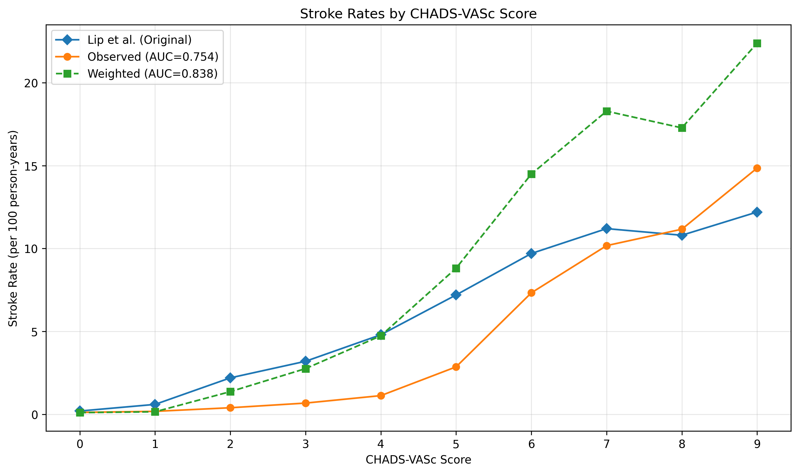

# CHADS-VASc Density Ratio Reweighting Results

## Analysis Metadata

```json
{
  "data_file_name": "random_nuchad.csv",
  "data_file_creation_date": "2025 Jul 08 15:03",
  "analysis_run_date": "2025 Jul 08 15:28",
  "num_patients": 87220,
  "analysis_type": "density_ratio_reweighting",
  "effective_sample_size": 24575.944508957004,
  "results_directory": "/home/joe/skunk_here/refactor_cleaning/results",
  "original_auc": 0.7537893173796046,
  "weighted_auc": 0.8383572124709349
}
```

## Weight Statistics

- Number of patients: 87220
- Weight range: 0.02 - 45.04
- Weight mean: 1.00
- Effective sample size: 24575.9 (28.2% of original)

## Performance Metrics

- Original AUC: 0.754
- Weighted AUC: 0.838

## Stroke Rates by CHADS-VASc Score (per 100 person-years)

| CHADS-VASc | Lip et al. Rate | Observed Rate | Weighted Rate |
|------------|-----------------|---------------|---------------|
| 0 | 0.2 | 0.12 | 0.10 |
| 1 | 0.6 | 0.18 | 0.15 |
| 2 | 2.2 | 0.40 | 1.37 |
| 3 | 3.2 | 0.68 | 2.76 |
| 4 | 4.8 | 1.13 | 4.74 |
| 5 | 7.2 | 2.86 | 8.81 |
| 6 | 9.7 | 7.33 | 14.49 |
| 7 | 11.2 | 10.17 | 18.28 |
| 8 | 10.8 | 11.16 | 17.27 |
| 9 | 12.2 | 14.85 | 22.38 |

## Figures


