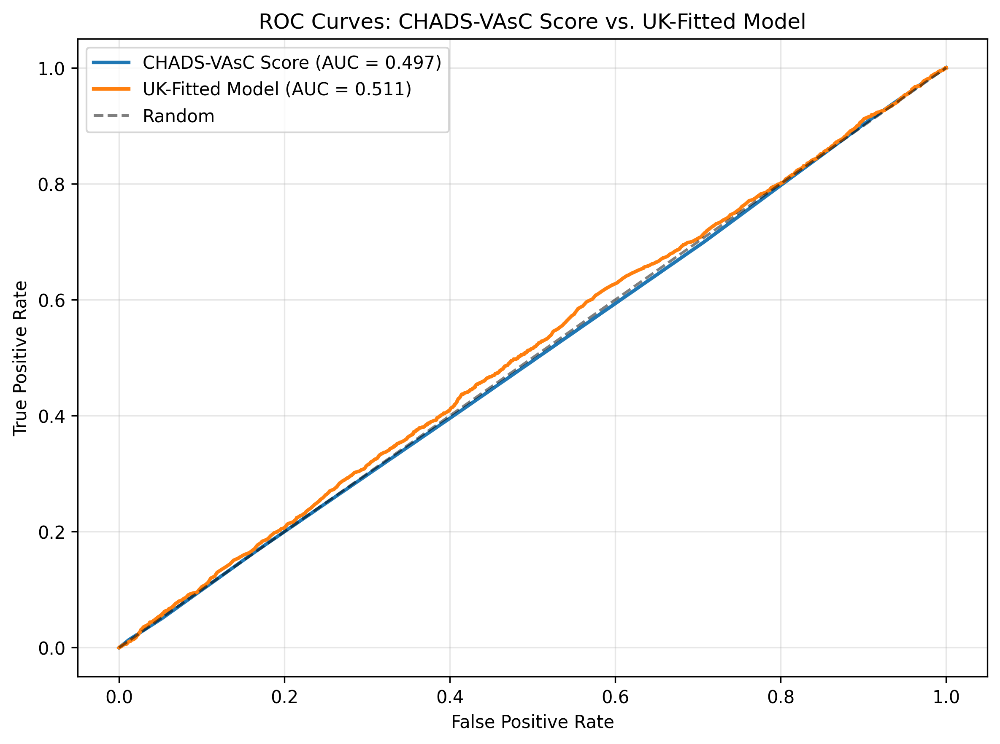

# Model Comparison: CHADS-VAsC Score vs. UK-Fitted Model

## Overview

Comparison of discrimination performance between:
1. **Off-the-shelf CHADS-VAsC**: Using published risk tables from Lip et al.
2. **UK-Fitted Model**: Logistic regression trained on UK cohort data

## Sample Characteristics

- Total patients: 87,220
- Stroke events: 4,458 (5.1%)
- Mean age: 73.8 years
- Female: 47.6%

## Discrimination Performance

| Metric | CHADS-VAsC Score | UK-Fitted Model | Difference (95% CI) |
|--------|------------------|-----------------|---------------------|
| AUC | 0.754 | 0.858 | +0.104 [0.098, 0.110] |

## Model Coefficients (UK-Fitted Model)

| Feature | Coefficient | Odds Ratio |
|---------|-------------|------------|
| age | 0.038 | 1.039 |
| hf | -0.140 | 0.869 |
| hypertension | 0.142 | 1.152 |
| HB_stroke_history | 9.633 | 15258.737 |
| diab | 0.174 | 1.191 |
| vasc_dis_mi_pad | -0.083 | 0.920 |
| female | -0.059 | 0.943 |

**Intercept:** -6.853

## Interpretation

The UK-fitted model shows **improved discrimination** compared to the off-the-shelf CHADS-VAsC score (ΔAUC = +0.104).

## Figures

