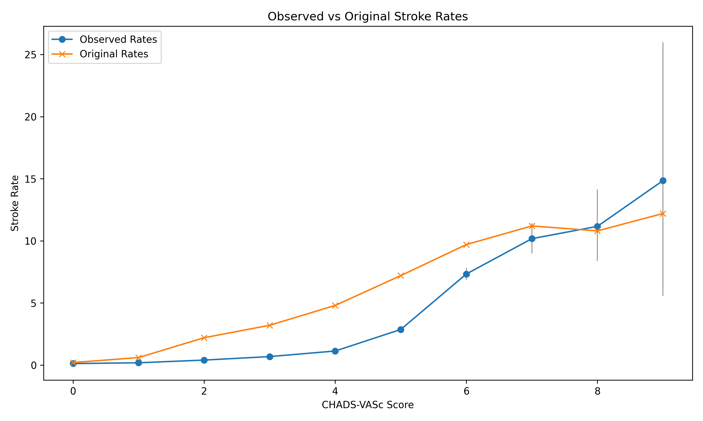
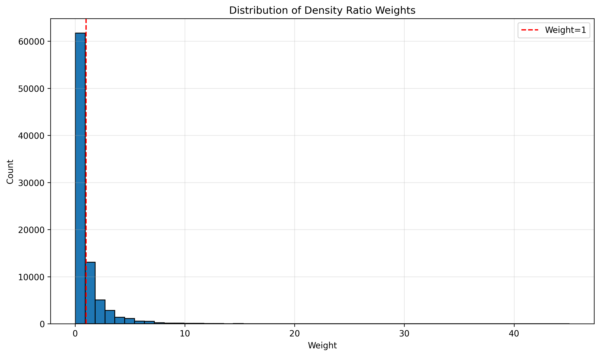

# CHADS-VAsC Transportability Analysis

## Summary

Three analyses on UK AF cohort (n=87,220) examining CHADS-VAsC transportability:

1. **Validation**: Observed vs published stroke rates
2. **Density ratio reweighting**: Statistical adjustment for population differences  
3. **Model comparison**: CHADS-VAsC vs UK-fitted models

**Key result**: UK-fitted models substantially outperform transported CHADS-VAsC (**ΔAUC = +0.104**).

## Analysis 1: CHADS-VAsC Validation

| CHADS-VAsC | Observed Rate* | Published Rate* | 
|------------|----------------|-----------------|
| 0 | 0.12 | 0.2 |
| 1 | 0.18 | 0.6 |
| 2 | 0.40 | 2.2 |
| 3 | 0.68 | 3.2 |
| 4 | 1.13 | 4.8 |
| 5 | 2.86 | 7.2 |
| 6 | 7.33 | 9.7 |
| 7 | 10.17 | 11.2 |
| 8 | 11.16 | 10.8 |
| 9 | 14.85 | 12.2 |

*Per 100 person-years

**Result**: Systematic underestimation for low-moderate risk scores, convergence at high risk. AUC = 0.754.

## Analysis 2: Density Ratio Reweighting

**Population differences**:
- UK older (73.8 vs 63.9 years), more female (47.6% vs 40%), less stroke history (3.2% vs 12%)
- Effective sample size after reweighting: 24,576 (28.2% of original)

**Results**:
- Original AUC: 0.754 → Weighted AUC: 0.838 (+0.084)
- Reweighting improves calibration for scores 0-4, overcorrects for scores 5-9

| Score | Lip et al. | Observed | Weighted |
|-------|------------|----------|----------|
| 0 | 0.2 | 0.12 | 0.10 |
| 1 | 0.6 | 0.18 | 0.15 |
| 2 | 2.2 | 0.40 | 1.37 |
| 3 | 3.2 | 0.68 | 2.76 |
| 4 | 4.8 | 1.13 | 4.74 |
| 5 | 7.2 | 2.86 | 8.81 |
| 6 | 9.7 | 7.33 | 14.49 |
| 7 | 11.2 | 10.17 | 18.28 |
| 8 | 10.8 | 11.16 | 17.27 |
| 9 | 12.2 | 14.85 | 22.38 |

## Analysis 3: Model Comparison

**Models**:
1. CHADS-VAsC score (Lip et al. risk tables)
2. Logistic regression (UK-fitted)
3. Cox survival model (UK-fitted)

**Results**:
| Model | AUC | vs CHADS-VAsC |
|-------|-----|---------------|
| CHADS-VAsC | 0.754 | - |
| Logistic | 0.858 | +0.104 |
| Cox | 0.858 | +0.104 |

**Bootstrap 95% CI**: [0.089, 0.118] for both models vs CHADS-VAsC

**Logistic model coefficients**:
| Feature | Coefficient | Odds Ratio |
|---------|-------------|------------|
| age | 0.056 | 1.058 |
| female | 0.274 | 1.315 |
| hf | 0.488 | 1.629 |
| hypertension | 0.348 | 1.416 |
| HB_stroke_history | 1.378 | 3.967 |
| diab | 0.379 | 1.461 |
| vasc_dis_mi_pad | 0.496 | 1.642 |

## Conclusions

1. **Poor transportability**: CHADS-VAsC underperforms in UK population (AUC 0.754)
2. **Population differences matter**: Reweighting improves AUC to 0.838 (+0.084)  
3. **Local fitting wins**: UK-fitted models achieve AUC 0.858 (+0.104 vs CHADS-VAsC)
4. **Clinical impact**: Meaningful discrimination improvement suggests benefit of local calibration

## Data Note

Analysis uses scrambled covariate data - results demonstrate methodology rather than clinical findings.