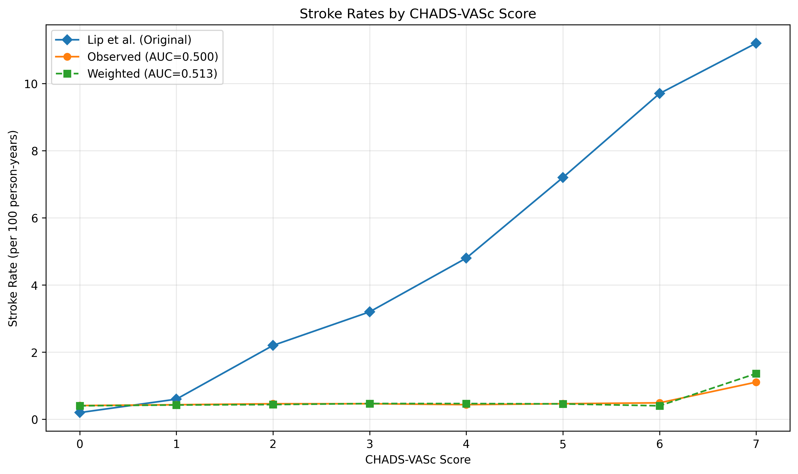

# CHADS-VASc Density Ratio Reweighting Results

## Analysis Metadata

```json
{
  "data_file_name": "random_nuchad_250623.csv",
  "data_file_creation_date": "2025 Jul 08 12:11",
  "analysis_run_date": "2025 Jul 08 12:48",
  "num_patients": 92115,
  "analysis_type": "density_ratio_reweighting",
  "effective_sample_size": 24113.210146431287,
  "results_directory": "/home/joe/skunk_here/nuchad/results_250623",
  "original_auc": 0.5002337411564396,
  "weighted_auc": 0.5129946902868613,
  "dataset_version": "250623"
}
```

## Weight Statistics

- Number of patients: 92115
- Weight range: 0.01 - 38.17
- Weight mean: 1.00
- Effective sample size: 24113.2 (26.2% of original)

## Performance Metrics

- Original AUC: 0.500
- Weighted AUC: 0.513

## Stroke Rates by CHADS-VASc Score (per 100 person-years)

| CHADS-VASc | Lip et al. Rate | Observed Rate | Weighted Rate |
|------------|-----------------|---------------|---------------|
| 0 | 0.2 | 0.41 | 0.40 |
| 1 | 0.6 | 0.43 | 0.43 |
| 2 | 2.2 | 0.46 | 0.44 |
| 3 | 3.2 | 0.46 | 0.47 |
| 4 | 4.8 | 0.44 | 0.47 |
| 5 | 7.2 | 0.46 | 0.46 |
| 6 | 9.7 | 0.49 | 0.40 |
| 7 | 11.2 | 1.11 | 1.36 |

## Figures


